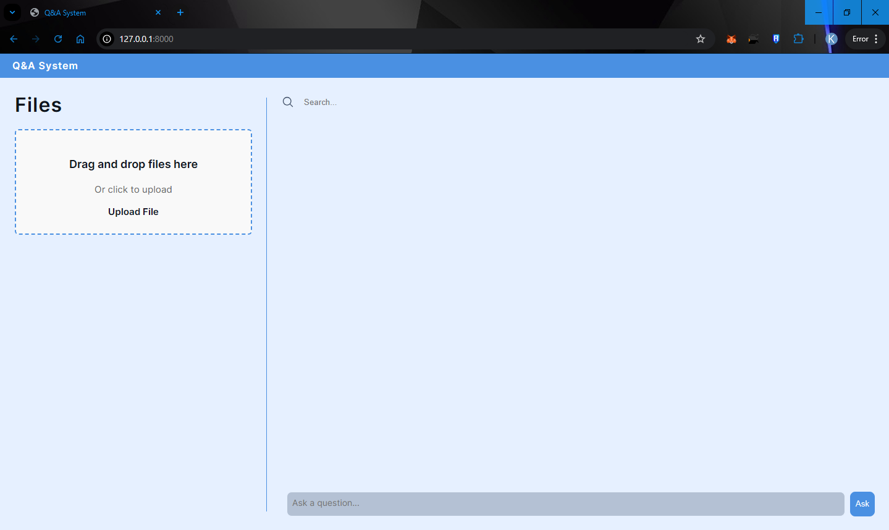
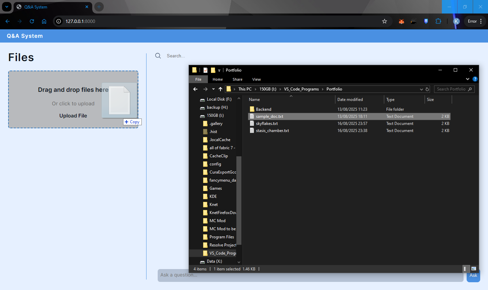
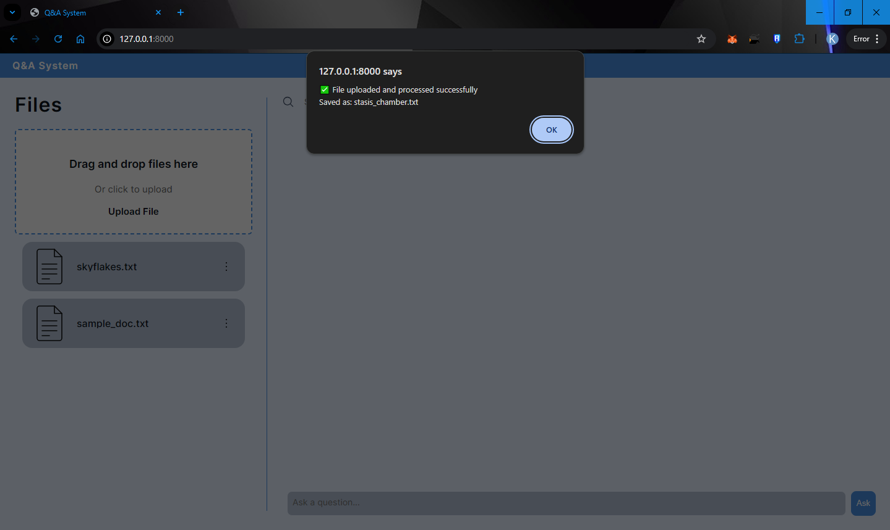
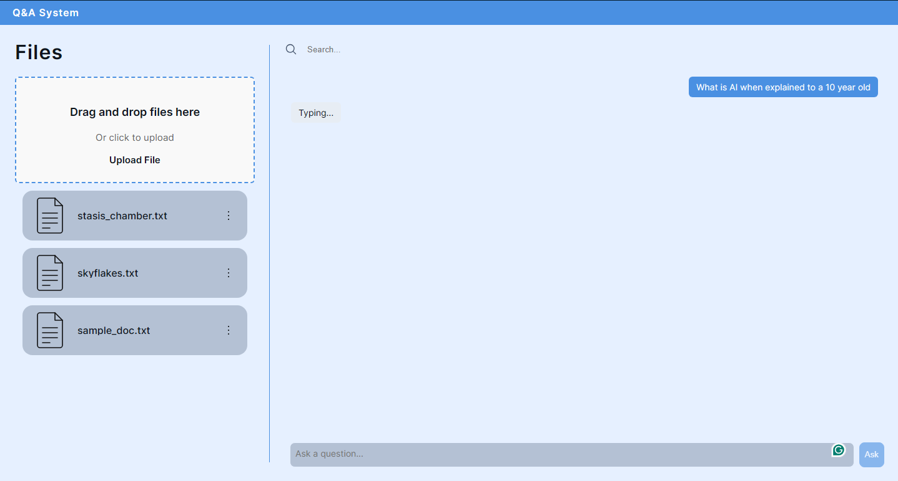
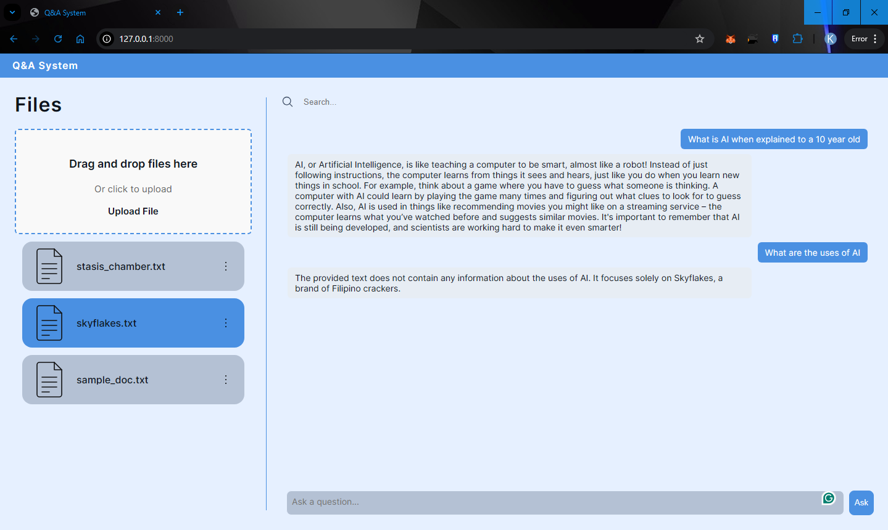
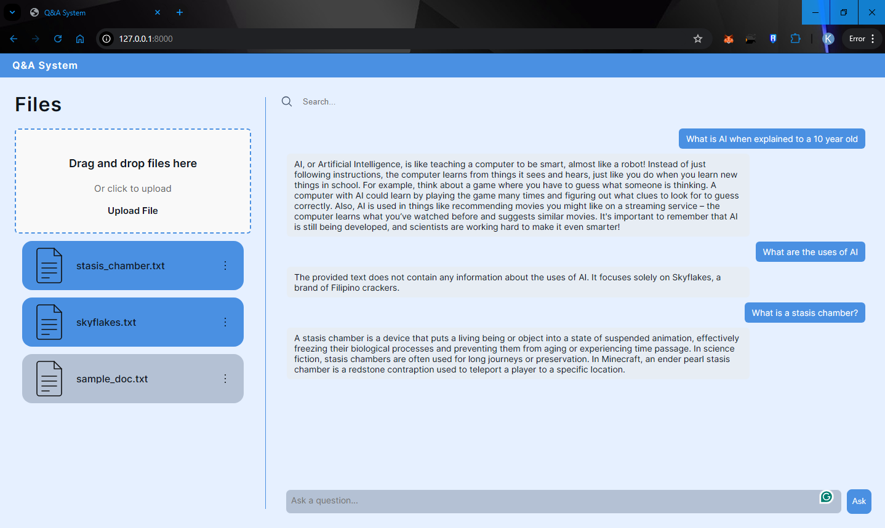
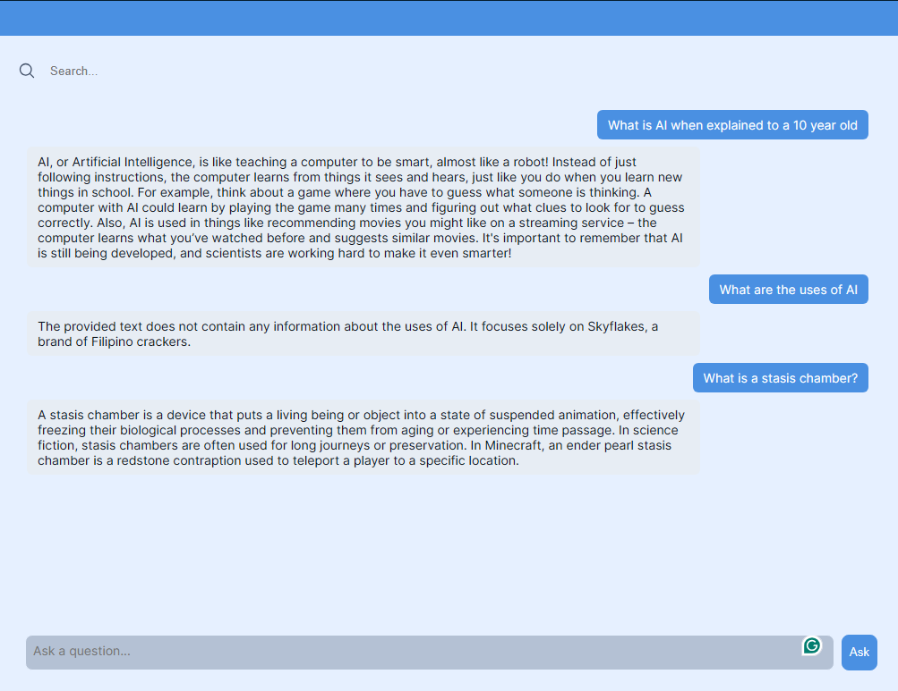
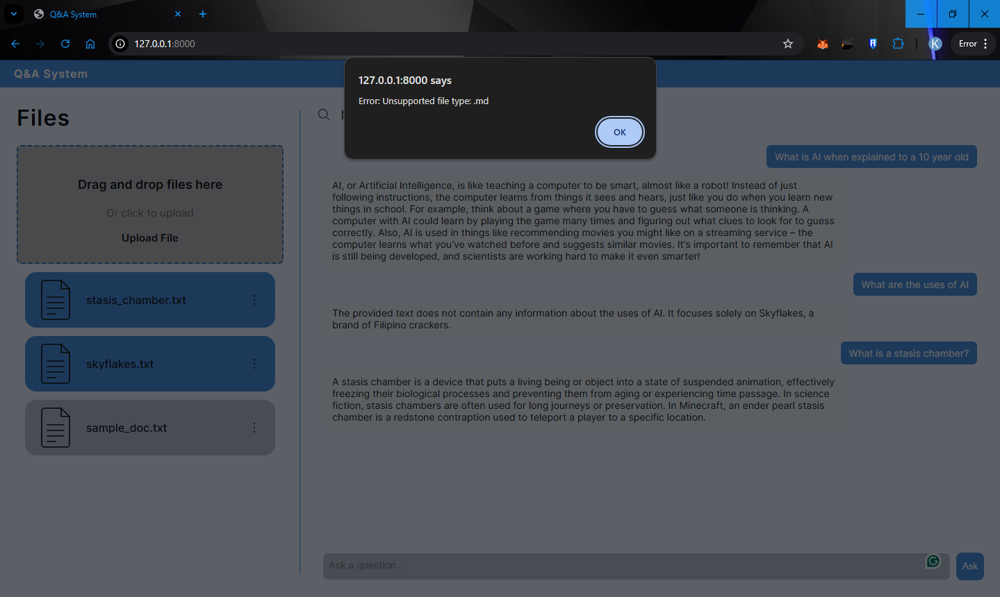

---
# 📘 Multi-Document Q/&A WebApp

A web application that lets you **upload, manage, and query multiple documents** using a **Retrieval-Augmented Generation (RAG)** pipeline.

Users can upload files, rename/delete them, and ask natural-language questions to retrieve answers grounded in the document content.
---



## 🚀 Features

### 📂 Document Management

- Upload multiple documents at once (PDF, TXT, DOCX, etc.).
- Rename or delete uploaded files.
- Select one or more documents for targeted Q/&A.




---

### 💬 Question Answering with RAG

- Ask free-form questions in the expandable input box.
- Answers are generated by an **LLM with retrieval augmentation** → grounded in document content.
- Supports asking across _all documents_ or _selected ones_.





---

### 📝 Chat History

- Displays Q/&A in a conversational format.
- Auto-scrolls to the latest response.
- Stores past queries for context reference.



---

### 🔍 Search in Chat History

- Search across past Q/&A messages.
- Highlights matches with a border.
- Navigate between results using **Next** / **Previous** buttons.
- Clearing the search removes highlights.


---

### ⚡ Error Handling

- Handles unsupported file formats gracefully.
- Prevents empty questions from being submitted.



---

## 🛠️ Tech Stack

### **Frontend**

- HTML5, CSS3, JavaScript (Vanilla)
- Responsive, interactive UI with dynamic rendering

### **Backend**

- **Python (FastAPI)** – for API routing & document management
- **RAG pipeline** – chunking + embedding + retrieval
- **LLM (via LLAMA.CPP)** – for generating answers
- **Vector Database** – for storing document embeddings (SQLite)

### **Other**

- RESTful API endpoints for document operations & queries
- Asynchronous request handling for fast responses

---

## ⚙️ API Endpoints

### Document Management

```http
POST /document/upload       # Upload a new document
POST /document/rename       # Rename an existing document
DELETE /document/delete     # Delete a document
GET /document/list          # List all uploaded documents
```

### Q/&A

```http
POST /query                 # Ask a question (all docs or selected docs)
```

### Chat Search

```http
GET /chat/search            # Search chat history
```

---

## 📖 How to Use

1. **Upload Documents**

   - Drag and drop or use the upload button.
   - Files appear in the document list.

2. **Manage Documents**

   - Rename or delete from the list.
   - Select one or more for focused queries.

3. **Ask a Question**

   - Type into the expandable question bar.
   - Press **Ask** or hit **Enter**.
   - View AI-generated answers in chat format.

4. **Search Past Q/&A**

   - Enter a term in the search bar.
   - Navigate through matches with **Next / Previous**.

---

## 📸 Screenshots

- Home / Empty state
- Upload & List view
- Rename / Delete
- Question answering
- Chat history
- Search functionality
- Error handling

---

## 💡 Skills Demonstrated

- **Full-Stack Development**: Built with Python (FastAPI backend) and HTML/CSS/JS frontend.
- **AI Integration**: Implemented **RAG pipeline** for document-grounded Q/&A.
- **Asynchronous APIs**: Fast, responsive REST endpoints.
- **Frontend UX**: Dynamic DOM updates, search highlighting, expandable text areas.
- **Error Handling & Validation**: Robust file and query checks.

---

## 📌 Future Improvements

- User authentication & saved sessions.
- More file types (images → OCR → embeddings).
- Export chat history.
- Live collaboration.

---
